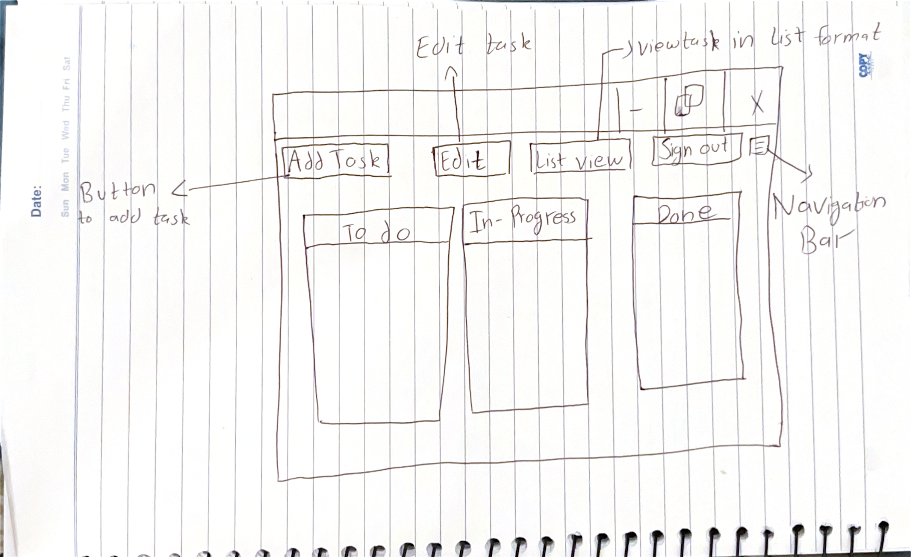

# Proposal: Task-Tracking Web Application

## 1. Description
This project aims to create a task-tracking web application that allows users to manage tasks through a list view and a kanban-style board view. The core features will include task creation, editing, and viewing task history at any point in time. Users will also be able to move tasks across different states or columns, similar to GitHub Projects, but with additional features like task history at any given time.

From a developer’s perspective, the project will involve building a server-side component that handles task management, including maintaining historical task data, and a front-end interface that presents tasks in various formats. The server will handle user authentication, task management, and history tracking, while the client will offer an intuitive interface for users to view and manage their tasks.

## 2. Screens

- **Diagram 1: Home Page**
  
- **Diagram 2: Board View**
  - A drag-and-drop interface where tasks are displayed as cards under different status columns (e.g., "To Do," "In Progress," "Completed").
  - Users can move tasks between different columns to change their status.
 

- **Diagram 2: Add Task Page**
  
 

## 3. Features

| ID  | Name                        | Short Description                              | Server or Client |
| --- | --------------------------- | ---------------------------------------------- | ---------------- |
| 01  | Entering tasks               | User creates a new task                        | Both             |
| 02  | Task history                 | Database maintains a history of all tasks      | Server           |
| 03  | Task details                 | Users can view the details of a specific task  | Both             |
| 04  | Task updates                 | Users can update task details                  | Both             |
| 05  | View task history            | View a task at any point in its history        | Both             |
| 06  | List view                    | Display tasks in list format                   | Client           |
| 07  | Board view                   | Display tasks in a kanban-style board view     | Client           |
| 08  | Move task between columns    | Users can move tasks between columns           | Client           |
| 09  | Task assignment              | Assign users to tasks                          | Both             |
| 10  | Task filtering               | Filter tasks based on status, due date, etc.   | Client           |
| 11  | User login                   | Users can log in and access their tasks        | Server           |
| 12  | Task sorting                 | Sort tasks by due date, priority, etc.         | Client           |
| 13  | Task categories              | Users can create custom task categories        | Both             |
| 14  | Comments on tasks            | Users can add comments on tasks                | Both             |
| 15  | Due date reminder            | Set due date reminders for tasks               | Both             |
| 16  | Task priority                | Assign priorities to tasks                     | Both             |
| 17  | Task archiving               | Archive completed tasks                        | Server           |
| 18  | Multi-user board sharing     | Multiple users can share a task board          | Server           |
| 19  | Task search                  | Search tasks by name or description            | Client           |
| 20  | User roles                   | Define user roles for accessing tasks          | Server           |
| 21  | Task analytics               | Visual analytics for tasks (e.g., progress)    | Both             |
| 22  | Real-time updates            | Real-time task updates for all users           | Both             |
| 23  | Mobile view support          | Responsive design for mobile devices           | Client           |
| 24  | API for third-party access   | Expose task data through an API                | Server           |
| 25  | Integration with calendars   | Integrate tasks with Google Calendar, etc.     | Both             |

## 4. Implementation

### Tools and Packages:
- **Node.js** for server implementation
- **MongoDB** for database storage and task history management
- **Express.js** for building the web server and API
- **React.js** for the front-end user interface
- **Socket.io** for real-time task updates
- **Mongoose** for managing MongoDB data with schema-based models
- **JWT** for user authentication and session management
- **Redux** for state management on the client side
- **Bootstrap or TailwindCSS** for responsive UI design

### App API:
- **GET /tasks**: Returns a list of all tasks.
- **POST /task**: Create a new task.
- **GET /task?id=taskid**: Returns the details of a specific task.
- **PUT /task?id=taskid**: Update the information for a task.
- **DELETE /task?id=taskid**: Delete a specific task.
- **GET /task/history?id=taskid&timestamp=time**: Retrieve the task history at a specific point in time.
- **POST /user/login**: Login a user to the system.
- **POST /user/signup**: Register a new user.
- **PUT /task/assign?id=taskid&userid=userid**: Assign a user to a specific task.

